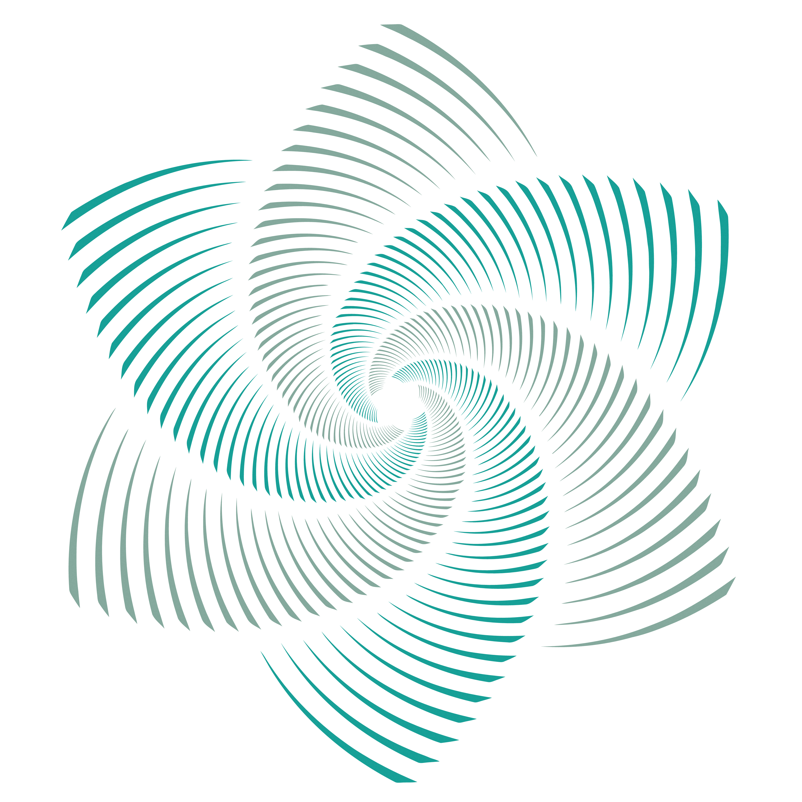
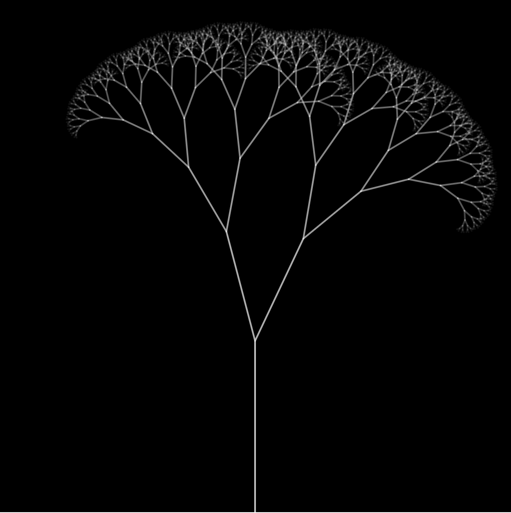

# Quiz 8

## Part 1: Imaging Technique Inspiration

My inspiration comes from fractal images, especially the recursive tree animation commonly seen in generative art. This technique creates the illusion of organic growth by repeatedly drawing smaller branches from different angles and proportions to construct complex natural structures. I want to incorporate this self-repeating structure and wind-like movement into my assignment because it is both visually expressive and technically modular. Although the result seems complex, it can be achieved through a single recursive function, which is highly suitable for the requirement of using reusable code structures in animations.

## Part 2: Coding Technique Exploration

The example I found is to implement this imaging idea by using a recursive function combined with time-based Angle modulation. Each branch is drawn by repeatedly calling the same function, and both its length and depth will decrease. Wind-like movement is created by adding multiple sin () and cos () waves based on millis () to offset the branch Angle. This technique is visually natural but mathematically simple, and it meets the assignment requirements of modular and reusable animation logic.

**Reference code:**  
[Link Text](https://editor.p5js.org/SpacedMonkeyTCT/sketches/dLlejgKxP)

